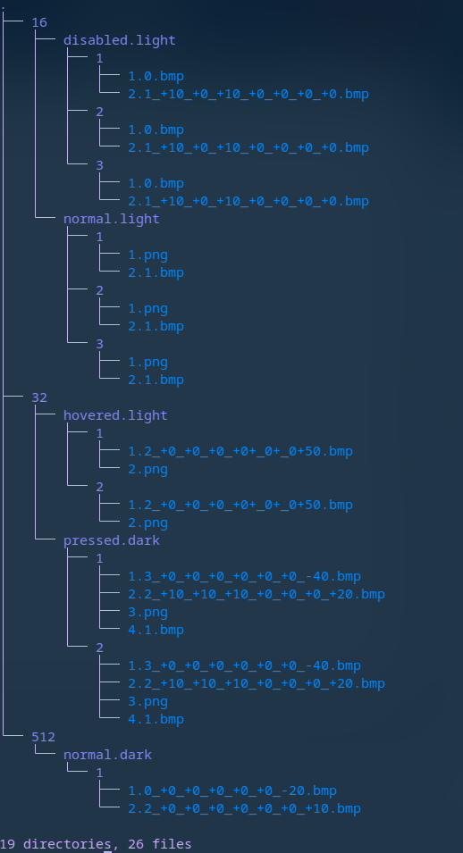
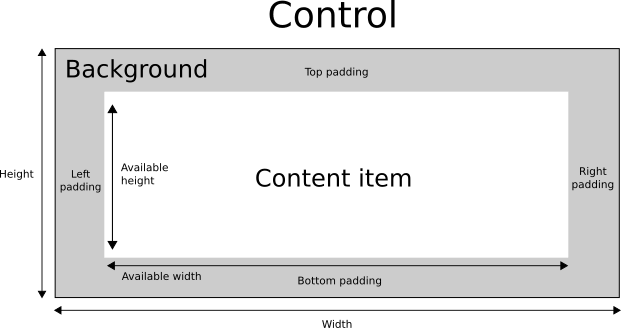

# 一、DCI图标介绍

`DCI` 图标是一种整合性图标格式，应用可以使用该图标完成多种状态的自动变化。例如， `ListView` 控件中高亮的 `Item` 图标自动反白，`Menu` 中图标跟随当前 `Item` 变化等等。

`dtkcore` 中提供了一个 `DDciFile` 的类，实现 `DCI` 文件的逻辑。其只是对数据的打包，不限于图片数据，可以是任何文本和二进制数据。 `dtkcore` 中还提供了用于在文管中解析文件的文件引擎，专门用于通过 `QFile` 和 `QDir` 处理 `dci` 文件。
dtkgui 中提供了一个 `DDciIcon` 类，实现了对 `DCI` 图标的逻辑。区别于 `DDciFile` ，它是 `DDciFile` 的上层封装，即使用 DDciFile 可以将文件进行打包归档的功能，封装了一种图标格式。 `DDciIcon` 中提供的接口，都是针对图标的，并无 `DDciFile` 的数据处理操作，多个 `DDciIcon` 进行数据拷贝和交换时，可以进行数据共享。 `DDciIcon` 可以通过调用 pixmap 函数返回需要显示的图片数据，也可以通过调用 paint 函数直接将内容绘制到目标内部。解析 Dci 图标的过程，这里讲解一下，详细过程可以查看代码理解：
首先需要创建一个 DDciFile 来解析 (*.dci) 文件，无论是本地文本还是二进制数据，都可以通过 `DDciFile` 来解析内部内容。
根据 `DDciIcon` 中规定好的路径格式，来解析出图标中拟定的各种信息，一般情况下的 `DDciIcon` 的路径格式是这样的：


最上层时 `/` 作为根目录（ `DCI` 文件都必须使用 `/` 作为根目录）。
第一层子目录（ 16、32、512 ）作为图标的大小。一般情况下是图标在 @1（1倍缩放比） 时的大小（在目前的使用设计师使用的 dci 图标插件的）。例如上述图标，传入的大小在 0-16时选择 16，传入大小在 16-32 时选择 32，... 以此类推。
第二层目录（ `normal.light` ）作为该层图标的状态和主题，其中状态分为 `Normal` ， `Disabled` ， `Hovered` 和 `Pressed` 四种，主题分为 `light` 和 `dark` 两种。四种状态和两种主题可产生 8 种组合，也就是说，每种大小的图标最多有八种不同状态和主题的子图标进行切换。需要注意的是：状态和主题存在缺省模式： `normal` 和 `light` 。如果传入的状态和主题在所属大小的子图标下未找到，则选择缺省模式的状态和主题。也就是说，当图标的 `Normal` 和 `light` 状态未找到任何图标时，该图标是无效的。一般情况下，如果图标不会在不同状态和主题下发生过大的样式修改，只修改内部颜色填充时，可以不添加特殊状态的图标，通过修改调色版解决。（后面提及）
 第三层目录（1、2）作为缩放比系数，可以存放多个缩放比系数来适配系统的缩放比。例如上述示例：缩放比系数在1和2之间时，选择 2，大于 2 时，选择 2 ，默认情况下选择 1。目前提供的图标中，为了保证尽量减少图标文件的大小，仅保存缩放比为 3 的文件。在软件层面进行缩放。
第四层（1.png）描述图标图片文件（图层）所携带的信息。这些信息中，包含：图层优先级、外边框数值、调色板格式、颜色调整数值、图层格式。可以通过下述文件表示：
```
├──  1.7p.3.png.alpha8
├──  2.3.webp
└──  3.7p.3_0_0_-10_0_0_0_0.png.alpha8
     │  │ │ │ │  │ ┕━┳━┙┕━┳━┙
     │  │ │ │ │  │   rgba   format
     │  │ │ │ │  │     
     │  │ │ │ │  └─ lightness （亮度）
     │  │ │ │ └─ saturation (饱和度)
     │  │ │ └─ hue (色调)
     │  │ └─ palette （高亮色3）
     │  └─ padding （填充间隔）
     └─ prior （图层）
    
<prior>.[padding].<p_h_s_l_r_g_b_a>.<format>
```
下面进行一一介绍：

**图层优先级**(`prior`)：优先级代表图层的绘制顺序，从 1-n 进行绘制，最底层的图层会被上层图层覆盖。

**外边框数值**(`padding`)：外边框在有阴影效果的图标中充分利用。 `padding` 代表图层外围不被控件大小覆盖的区域。



类似控件的布局方式，这里可以之看 `padding` 部分， `padding` 定义四周所有数据，举个例子，如果子图标的大小是 32 (第一层目录的数值)，一倍缩放比下，如果该图层的 `padding` 大小时 5，那么该图层的真实图片大小是：[32 + 5 × 2, 32 + 5 × 2] = [42, 42]。但最终， `padding` 区域的大小并不计算在整个图标大小内（仅针对 QML，dtkwidget 不支持）。为了区别其他数据， `padding` 的数值后面使用 `'p'` 进行结尾。例如上述示例：`'7p'` 。

**调色板格式**：当存在调色板时，就表示该图标的颜色是通过调色板的颜色进行动态变化的，外部修改调色板颜色后，预览效果会随之发生变化。因此该图标有两种特性：1. 可以转换成 alpha8 格式; 2. 可以不需要其他状态，通过调色板变化即可。当无调色板时，该部分的数值为空。调色板格式分为5种：无效（-1）、前景色（0）、背景色（1）、高亮前景色（2）、高亮色（3）。

**颜色调整数值** ：颜色调整只针对有调色板的图层（调色板格式部分数据不为空）时。一旦存在，必须要将其所有的数据写入，例如上述示例。颜色调整数值使用 '_' 进行分割。每个部分表示：hue、saturation、lightness、red、green、blue、alpha。

**图层格式** ：图层格式可以使用："png"、"jpg"、"webp"。如果图层存在调色板格式，就意味着可以优化其大小，转化为 alpha8 格式，使用".alpha8" 作为后缀，进行标识，在软件渲染时进行进行复原。

`DCI` 图标的细节介绍在 应用图标，上面主要介绍 `DCI` 图标的整个结构和在 `QML` 中的使用方式。其主要是设计实现了一种特殊格式的文件（.dci），该种格式通过路径，名称和文件数据，打包到同一个文件内，使不同状态、大小、主题的多个图标图片，整合到同一个文件内，在程序内部自动匹配当前状态，选择合适的图标图片。因此，总的来说， `DCI` 图标是对多个图标图片的打包归档。

本文将介绍 `DCI` 图标在 `dtkwidget` 和 `dtkdeclarative` 中的使用，对于一些 `DCI` 图标相关的高级知识（使用方无需过度关心），如 “DDciIconPalette”、“缩放比的适配”以及“图片的格式”等等。

**请注意：** 当使用 `DciIcon` 时，如果您认为控件在某种状态下需要进行图标变色或更换图标而未出现时，可能是由于**设计提供的图标未指定变色所需要的调色板对象（可以理解为图标出错）**或**设计认为该种场景下不需要变色（即固定样式图标）**，请及时与设计沟通。

## 1. 图标状态

大部分控件可以分为 `Normal` 、 `Hovered` 、 `Pressed`  和 `Disabled` 四种状态。这四种状态是每种控件的基础状态。因此将使用这几种状态作为图标的状态分类。

### **答疑**

1. 为什么没有  `Checked` 和 `Inactive` 类似这样的状态？

   `Checked` 状态属于复合状态，并不属于基础状态。 `Checked` 状态下，可以有 `Hovered` 、 `Pressed` 、 `Normal` 等等状态，相同地， `Unchecked` 状态也会存在一样的情况。因此， `Checked` 状态并不适合作为 `DCI` 图标的状态。对于需要时，可通过控件的 `checked` 状态属性，切换下不同的图标即可。

   `Inactive` 状态作为窗口的状态，在 `DTK` 应用都会通过降低透明度的方式实现，而不是作为图标状态。

2. 为什么需要这些状态？

   存在这些状态的原因是，为了让应用和开发者更加无感知的使用图标，而无需关心不同状态下进行图标切换的操作。方便设计师一次提供多种状态的图标到一个图标文件中，进行压缩整合。防止出现图标资源较多，占用较大系统内存，同时能够帮助设计师在控件的不同状态下，不仅仅只局限于修改图标颜色这一种功能，也可以通过不同的图标代替，更适合多样化的样式设计。

3. 图标不显示可能是什么原因？

      很可能是 webp 格式的支持问题， 查看一下系统中是否安装 `qt5-image-formats-plugins` ，这个包中有对 webp 格式图片格式的支持。

## 2.  图标大小和缩放比

应用所关心的图标大小是否正常，是否能够适配高缩放比模式等等。 `DCI` 图标中都做到了这些，默认情况下，设计师所提供的图标大小能够满足应用开发的需求，应用只需要主动调用接口指定图标大小即可，例如 `dtkwidget`,中 `DIconButton` 可以使用 `setIconSize` 指定； `QML` 中可以指定 `DciIcon` 控件的 `sourceSize` 或者 `Button` 控件的 `icon.size` 等等。而对于高缩放比的适配， `DTK` 已经全部完成无需应用关心。

# 二、如何使用

对于开发来讲，这个全新图标格式如何正常使用，这里将分别说明在 dtkwidget 和 dtkdeclarative(qml) 中的使用。

### 1. dtkwidget 项目的使用

DCI 图标和 QIcon 图标有异曲同工之妙，dtkgui中提供了 DDciIcon 类方便直接使用。

**（1） 部分接口介绍（有问题可以到开发者邮件列表询问）：**

```c++
QPixmap pixmap(qreal devicePixelRatio, int iconSize, Theme theme, Mode mode = Normal,
               const DDciIconPalette &palette = DDciIconPalette()) const;
```

根据参数返回当前缩放比，图标主题，状态的 QPixmap 对象。

```c++
void paint(QPainter *painter, const QRect &rect, qreal devicePixelRatio, Theme theme, Mode mode = Normal, Qt::Alignment alignment = Qt::AlignCenter, const DDciIconPalette &palette = DDciIconPalette()) const;
```

与上一个接口类似，但此处传入 QPainter 对象，将图标内容直接绘制到对应设备上。

```c++
static DDciIcon fromTheme(const QString &name);
```

根据图标主题名称，从图标主题中寻找 DDciIcon 图标。

```c++
static DDciIcon fromTheme(const QString &name, const DDciIcon &fallback);
```

根据图标主题名称，返回从图标主题从寻找到的DDciIcon图标，未寻找到时返回fallback。

**(2) 使用场景描述：**

如一个 DIconButton 控件，可以直接传入一个 DDciIcon 对象，该对象可通过 DDciIcon::fromTheme 寻找，例如以下代码：

```c++
DIconButton iconButton(DDciIcon::fromTheme("window_close"));
```

可以使用 DDciIcon 的控件目前包括：`DIconButton`、`DButtonBox`、`DfloatingButton`、`DMessageManager`。Qt程序使用 QIcon 的，目前无法做到与 DciIcon 进行互转适配，也请不要手动进行 pixmap 互转，可能会出现状态和大小的异常现象。

### 2. dtkdeclarative(qml) 项目的使用

QML 中使用 DciIcon 更加灵活，能够在 DTK 中提供的所有控件中使用。

大多数情况下，使用 DciIcon 可直接指定 icon.name 即可，如下代码：

```qml
Button {
    text: "这是一个按钮"
    icon.name: "window_close"
}

// 或者

Menu {
    visible: true
    MenuItem {
        text: "菜单项1"
        icon.name: "myicon1"
    }
    MenuItem {
        text: "菜单项2"
        icon.name: "myicon2"
    }
}
```

当自定义 DDciIcon 控件时，除非你非常确信它不会跟随控件状态发生变化，否则请认真看完开发指南中对各个属性的讲解。

### 3. 图标主题

DciIcon 已经完成图标主题的相关内容实现，如上述代码 `DDciIcon::fromTheme` 该接口表示从图标主题中寻找资源。我们推荐应用在开发时，使用图标主题进行开发。是因为图标主题能够管理一系列风格一致的图标，当系统设置中更换图标主题时，能够做到应用图标的统一更换，实现图标风格切换的流畅性，如果应用在开发过程中，DciIcon 不隶属于任何图标主题，它将在用户切换系统图标主题设置时不做任何修改。如遇上述情况，请严格寻找代码中是否从图标主题中寻找对应资源。

DCI图标主题请严格遵守如下图标主题目录，当系统中存在同名图标名称时，请优先使用系统资源，**目前V23的应用开发请放置在 built-in 资源目录下（`:/dsg/built-in-icons`）**:

图标主题目录命名规则为：在相应的目录下创建一个使用图标主题名称命名的文件夹，并在其内部存放所有该主题相关的 `DCI` 图标文件，`DCI` 图标文件必须统一使用 `*.dci` 作为文件后缀。例如以下例子：

```c++
// 内嵌图标目录
:/dsg
└── built-in-icons
        ├── application-exit.dci
        ├── appointment-new.dci
        ├── call-start.dci
        ├── call-stop.dci
        └── ...    
```

```c++
// 系统目录
/usr        
└── share
    └── dsg    
        └── icons
            └── bloom    
                ├── application-exit.dci
                ├── appointment-new.dci
                ├── call-start.dci
                ├── call-stop.dci
                └── ...
```

```
// 应用程序资源文件
:/dsg       
└── icons
    └── bloom    
        ├── application-exit.dci
        ├── appointment-new.dci
        ├── call-start.dci
        ├── call-stop.dci
        └── ...
```
图标主题的查找路径可以有多个，默认的路径列表为：

- `$DSG_DATA_DIR/icons` （默认情况下为 `/usr/share/dsg/icons` )
- `:/dsg/icons `
- ` :/dsg/built-in-icons` （程序内部资源路径的主题 Fall Back 路径，该路径下无需指定主题名称，将作为所有主题的 Fall Back 路径存在）

图标主题通过约定目录列表自身的顺序来指定查找的优先级，越靠前的目录优先级越高，此路径列表允许程序自定义，当未定义时使用上述的默认路径列表。如果路径列表下的相同主题存在重名图标文件，则优先级大的目录其图标文件会优先被查找。

例如按照上述定义的优先级规则，当主题名为 `bloom` 时，如果需要查找名为 `example` 的图标文件，那么查找的路径的默认先后顺序应该是：

1. `$DSG_DATA_DIR/icons/bloom/example.dci`
2. `:/dsg/icons/bloom/example.dci`
3. `:/dsg/built-in-icons/example.dci`

如果不同的图标主题路径下都存放一个相同主题的相同图标文件，则先找到的图标文件先返回。因此，如果需要进行图标的替换（即应用通过目录优先级的方式，自定义优先显示何种路径下的主题图标文件）时，请确保替换后的图标至少能够拥有被替换的图标的所有类型。否则可能出现存放在不同路径下，相同图标名称的不同图标类型的图标文件，仅能获取到优先级高的图标类型。

另外，DTK存在保留手段控制应用的图标主题，目的为了提供高定制化需求，如特殊场景下的特殊图标（Deepin 和 Uos 的图标定制，专业版、家庭版、个人版和其他特殊版本的图标定制）。